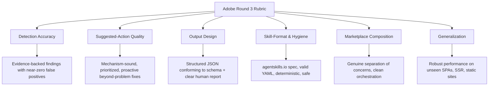

# Adobe University Hackathon 2026: Round 3 Deep Dive & Problem Breakdown

## 1. Executive Summary & Challenge Overview

The **Adobe University Hackathon 2026 (Campus Recruitment Program)** is one of Adobe's flagship competitive hackathons for identifying top-tier engineering, AI, and product talent. 

Having advanced through **Round 1 (OA: Coding & MCQs)** and **Round 2 (Brand Visibility Case Study)**, the shortlisted teams now face **Round 3: Development Round** — titled **"Build the Agent Skill Marketplace"**.

* **Round Timeline:** August 27, 2026, 02:30 PM IST — September 13, 2026, 11:59 PM IST
* **Format:** Take-home engineering challenge
* **Core Paradigm:** Building modular, reusable Agent Skills adhering to the standard `agentskills.io` specification, unified by a multi-skill marketplace architecture.

---

## 2. Core Problem Statement: Bridging Round 2 Reasoning into Automated Agent Skills

### 2.1 The Problem Context
* In **Round 2**, participants reasoned on paper about why modern brands suffer from AI invisibility, stale citations, and high bounce rates in generative search engines and AI assistants (e.g., ChatGPT Search, Perplexity, Claude, Google AI Overviews).
* In **Round 3**, participants must translate that conceptual understanding into **reusable agent skills** that can autonomously audit any given website.
* The agent must detect root causes hurting:
  1. **AI Discoverability (Off-site):** Can AI crawlers and LLM search agents reach, parse, understand, trust, and quote this brand?
  2. **On-Site Engagement (On-site):** Once an AI assistant directs a user to the website, does the landing page maintain context, retain the visitor, and convert/inform them without immediate bounce?

### 2.2 Core Mandates
1. **Learn from the wild:** Evaluate real-world websites to discover repeatable root causes rather than fitting to specific examples.
2. **Generalization by construction:** The submission is evaluated on unseen websites across diverse domains (SaaS, E-Commerce, Media, Local Services, Enterprise B2B, SPA Web Apps).
3. **Recommend-Only & Sandboxed:** The tool performs **read-only audits**; it never executes destructive actions, bypasses authentication, or alters live sites.
4. **Agent Skills Standards:** Built on the `agentskills.io` standard (`SKILL.md` with YAML frontmatter + structured markdown instructions + bundled `scripts/` and `references/`).
5. **Marketplace Composition:** A top-level `marketplace.json` manifest orchestrating multiple specialized skills via a designated `audit-orchestrator` entrypoint.

---

## 3. Submission Artifacts & Requirements Checklist

| Requirement | Specification | Enforcement / Constraint |
| :--- | :--- | :--- |
| **Package Format** | ZIP Archive of Marketplace Root | `≤ 50 MB` total size |
| **Manifest** | `marketplace.json` at root | Must list all skills and mark exactly one `entrypoint: true` |
| **Skill Format** | `agentskills.io` compliant | Each skill in `skills/<skill-id>/` must have `SKILL.md` |
| **Documentation** | Root `README.md` | Explaining skill capabilities, orchestration flow, and usage |
| **Runtime Limit** | `< 5 minutes` per site audit | Fast deterministic scripts, progressive disclosure |
| **Model Weights** | No pre-trained weights in zip | Portable, provider-neutral LLM runtime |
| **Safety** | Read-only sandbox | Respects `robots.txt`, no rate abuse, no auth bypass |

---

## 4. Evaluation Rubric & Scoring Matrix

The submission is judged by Adobe Senior Engineers and AI Architects based on the following six dimensions:



### Rubric Breakdown:

1. **Detection Accuracy (High Weight)**
   * Detects real structural, semantic, and contextual defects affecting AI discoverability and on-site engagement.
   * Every finding is supported by concrete, empirical evidence (e.g., exact DOM selectors, missing schema fields, robots.txt disallows, JS-rendering delta).
   * Low false-positive rate.

2. **Suggested-Action Quality (High Weight)**
   * Fixes are technically precise and mechanism-sound (e.g., providing actual ready-to-copy JSON-LD blocks, exact robots.txt rules, semantic HTML markup refactors).
   * Prioritized by business impact (Critical > High > Medium > Low).
   * Proactive recommendations: Suggests modern enhancements (e.g., LLM-friendly FAQs, AEO definition summaries, `sameAs` entity authority networks) even where no explicit defect broke the site.

3. **Output Design (Medium Weight)**
   * Entrypoint outputs strict JSON matching the required schema (floor) plus enriched diagnostic fields.
   * Executive summary with counts by severity.

4. **Skill-Format & Engineering Hygiene (Medium Weight)**
   * Valid YAML frontmatter, clean deterministic markdown steps.
   * Progressive disclosure: Lean `SKILL.md`, heavy checklists in `references/`, executable inspection logic in `scripts/`.

5. **Marketplace Composition (High Weight)**
   * Modular decomposition reflecting genuine separation of concerns (e.g., Crawl/Render vs. Structured Data vs. LLM Quotability vs. Freshness/Trust vs. On-site Engagement).
   * Orchestrator composes subordinate skills cleanly without bloat or redundant steps.

6. **Generalization (High Weight)**
   * Handles React/Next.js/Vue client-side hydrated SPAs, traditional WordPress/PHP sites, static documentation, modern e-commerce stores, and enterprise portals seamlessly.

---

## 5. Required Audit Output JSON Schema

The entrypoint skill must emit an audit report strictly conforming to the base schema, with support for enriched intelligence:

```json
{
  "site": "example.com",
  "audited_at": "2026-09-20T14:32:00Z",
  "summary": {
    "total_findings": 6,
    "critical": 1,
    "high": 2,
    "medium": 3,
    "low": 0
  },
  "findings": [
    {
      "id": "F-001",
      "title": "No JSON-LD structured data on product pages",
      "severity": "high",
      "category": "discoverability_structured_data",
      "evidence": "Crawled 12 product pages; 0/12 contain schema.org markup.",
      "suggested_action": {
        "summary": "Add Product/Offer JSON-LD to every product page.",
        "priority": "high",
        "implementation_code": "{\n  \"@context\": \"https://schema.org/\",\n  \"@type\": \"Product\",\n  \"name\": \"...\"\n}"
      }
    }
  ]
}
```

---

## 6. Key Takeaways & Strategic Imperative

To achieve the top 1% score in Adobe University Hackathon Round 3:
1. **Never build a monolithic single skill:** Decompose into 5 specialized, high-cohesion skills under 1 orchestrator.
2. **Deterministic execution over LLM hallucination:** Leverage bundled Python analysis scripts (`scripts/`) for fast, exact DOM parsing, schema validation, robots.txt matching, and text-ratio analysis, reserving LLM instructions for high-level synthesis and recommendation refinement.
3. **Provide ready-to-implement fix artifacts:** Include copy-pasteable JSON-LD snippets, robots.txt directives, and HTML semantic scaffolds in the `suggested_action` outputs.
