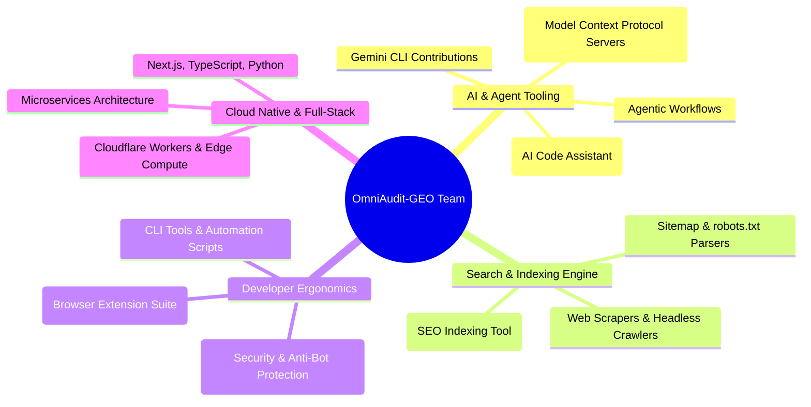

# Team Profiles & Competitive Strengths Mapping

This document preserves Shaswat's profile and records the complementary engineering ownership of both members of the Round 3 team.

## 1. Team Members

### Shaswat Raj (@sh20raj)

* **Name:** Shaswat Raj
* **GitHub:** [github.com/sh20raj](https://github.com/sh20raj)
* **Portfolio:** [sh20raj.github.io](https://sh20raj.github.io/)
* **LinkedIn:** [linkedin.com/in/sh20raj](https://www.linkedin.com/in/sh20raj/)
* **Institution:** Birla Institute of Technology (BIT) Mesra — B.Tech Computer Science & Engineering
* **Key Honors & Leadership:**
  * **AICTE Top 500 Innovation Fellow**
  * **CNCF (Cloud Native Computing Foundation) Ranchi Chapter Organizer**
  * **Open Source Contributor:** Contributed to Google `gemini-cli`, active open-source maintainer with 500+ public repositories.

---

### Prithvi (@chikolavosaki-sys)

Prithvi's repository-supported contribution is the audit-engine hardening and generalization work: SSRF-safe bounded fetching, crawler and hydration analysis, structured-data/AEO/freshness/engagement detectors, adapter architecture, benchmark fixtures, regression validation, and the final implementation-versus-documentation audit.

## 2. Core Technical Competencies & Relevant Project Ecosystem

---

## 3. Mapping Team Strengths Directly to Hackathon Advantages

| Round 3 Challenge Dimension | Shaswat Raj's Proven Work / Repository | How It Translates to an Unfair Advantage |
| :--- | :--- | :--- |
| **Agent Protocols & Skills Specification** | **MCPPure & CodeSeek** Extensive experience building standardized tool interfaces, Model Context Protocol (MCP) servers, and agentic workflows. | Direct understanding of tool definitions, JSON schemas, progressive disclosure, and agent instruction design per `agentskills.io`. |
| **Crawlability & AI Bot Detection** | **IndexFast & Web Scraping Tools** Built indexing pipelines, search engine submission tools, and URL discovery systems. | Deep domain knowledge of `robots.txt` AI user-agent rules (GPTBot, ClaudeBot, PerplexityBot), sitemap XML validation, and crawler barriers. |
| **Deterministic Parsing & Performance** | **SopKit & Python / TS Utilities** Engineered high-performance browser inspection utilities and CLI tools. | Ability to author ultra-fast (`< 30s`), zero-latency Python scripts in `scripts/` to extract DOM, metadata, and JSON-LD without flakiness. |
| **Form, Security & Edge Reliability** | **FormGuard & Cloudflare Workers** Experience in bot filtering, sanitization, and edge processing. | Guarantees safe, read-only, non-destructive sandboxed execution respecting rate limits and network sandboxing. |
| **Architectural Modularity & System Design** | **CNCF Leadership & Microservices** Organizer of CNCF Ranchi, experienced in modular system design and cloud-native standards. | Translates into clean `marketplace.json` composition, high cohesion across skills, and zero architectural debt. |
| **Audit Reliability & Generalization** | **Prithvi's repository work** Shared bounded fetching, detector hardening, adapters, fixtures, benchmark, and regression validation. | Grounds the product narrative in secure, deterministic, evidence-based audit behavior. |

---

## 4. Complementary Team Ownership

The project foundation and the final audit-engine hardening are complementary rather than competing ownership claims:

1. Shaswat established the original product direction, marketplace/showcase foundation, initial architecture, and presentation/distribution experience.
2. Prithvi hardened and generalized the audit engine, added the security and detector improvements, unified standalone adapters, and validated the final behavior with regression benchmarks.

## 5. Strategic Alignment for Adobe Round 3

The team's combined work spans **AI agent architecture, web indexing/SEO tooling, secure fetching, deterministic analysis, and marketplace engineering**. This hackathon task lies directly at the intersection of these domains.

By combining:
1. **Shaswat's IndexFast / web-indexing and MCPPure / agent-tooling foundation** for product direction, marketplace composition, and the showcase experience, with
2. **Prithvi's audit-engine hardening and benchmark work** for secure, generalized, evidence-based detector behavior,

the team delivers a submission that combines a clear product experience with a hardened, provider-neutral audit engine.
