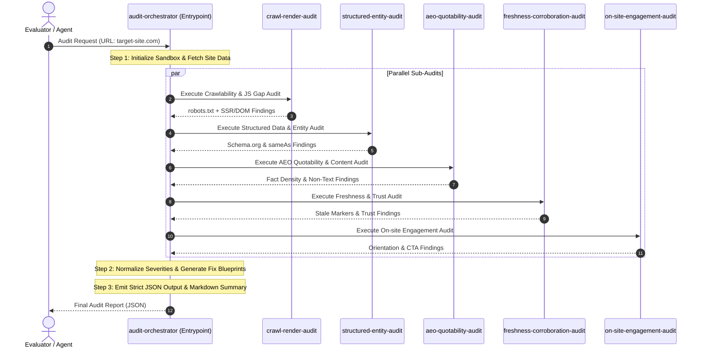

# Master Winning Strategy & System Architecture: Brand AI-Readiness Marketplace

## 1. Architectural Vision

The **Brand AI-Readiness Audit Marketplace** is an enterprise-grade agent skills marketplace designed to diagnose why a website fails to be discovered, cited, or recommended by generative AI engines (Off-site Discoverability) and why visitors bounce when arriving from AI referrals (On-site Engagement).

The solution strictly adheres to the `agentskills.io` standard, providing:
1. **High Cohesion & Clear Separation of Concerns:** Decomposed into 5 specialized audit skills governed by a single master entrypoint orchestrator.
2. **Progressive Disclosure:** Lean `SKILL.md` instruction files that delegate detailed checklists to `references/` and high-speed deterministic parsing to `scripts/`.
3. **Deterministic & Fast Execution:** Hybrid architecture using native Python scripts to fetch, parse, and score sites within 15–30 seconds (well within the `< 5 min` limit).
4. **Rich & Actionable Output:** Conforms strictly to the required JSON schema while delivering complete implementation-ready fix artifacts (ready-to-paste JSON-LD, robots.txt fixes, and semantic HTML patches).

---

## 2. High-Level Marketplace Architecture

```
brand-ai-readiness-audit/               <- Marketplace Root (Submittable ZIP Package)
├── marketplace.json                    <- Top-level Marketplace Manifest
├── README.md                           <- Comprehensive Documentation & Quickstart
├── skills/
│   ├── audit-orchestrator/             <- [ENTRYPOINT] Composes subordinate skills & formats report
│   │   ├── SKILL.md
│   │   ├── scripts/
│   │   │   └── audit_runner.py         <- Unified deterministic CLI runner & test harness
│   │   └── references/
│   │       ├── audit_schema.json       <- Target JSON report schema specification
│   │       └── severity_matrix.md      <- Rubric for Critical/High/Medium/Low classifications
│   │
│   ├── crawl-render-audit/             <- Skill 1: AI Bot Access & Hydration Delta
│   │   ├── SKILL.md
│   │   ├── scripts/
│   │   │   └── crawl_inspector.py      <- robots.txt parser, AI user-agent checker, SSR vs DOM diff
│   │   └── references/
│   │       └── ai_user_agents.md       <- Known AI crawlers (GPTBot, ClaudeBot, PerplexityBot, etc.)
│   │
│   ├── structured-entity-audit/        <- Skill 2: JSON-LD, Schema.org & Entity Disambiguation
│   │   ├── SKILL.md
│   │   ├── scripts/
│   │   │   └── schema_validator.py     <- JSON-LD / Microdata / OpenGraph parser & sameAs checker
│   │   └── references/
│   │       └── schema_blueprints.md    <- Organization, Product, FAQ, Article schemas
│   │
│   ├── aeo-quotability-audit/          <- Skill 3: LLM Quotability, Atomic Facts & Non-Text Gaps
│   │   ├── SKILL.md
│   │   ├── scripts/
│   │   │   └── quotability_scorer.py   <- Fact-to-filler ratio, definition sentence extraction, OCR/Alt check
│   │   └── references/
│   │       └── geo_guidelines.md       <- Generative Engine Optimization rules
│   │
│   ├── freshness-corroboration-audit/  <- Skill 4: Temporal Signals, Cross-Web Trust & Truth Verification
│   │   ├── SKILL.md
│   │   ├── scripts/
│   │   │   └── trust_corroborator.py   <- Stale date detector, contact info consistency, trust signals
│   │   └── references/
│   │       └── authority_signals.md    <- E-E-A-T & AI trust markers
│   │
│   └── on-site-engagement-audit/       <- Skill 5: Value Prop Orientation, Scents & Cognitive Friction
│       ├── SKILL.md
│       ├── scripts/
│       │   └── engagement_evaluator.py <- Hero fold analysis, Flesch-Kincaid readability, CTA clarity
│       └── references/
│           └── ux_heuristic_checklist.md
```

---

## 3. Detailed Breakdown of Skills

### Skill 0: `audit-orchestrator` (The Master Entrypoint)
* **Role:** Coordinates the entire audit lifecycle, executes specialized skill analyzers, aggregates raw findings, deduplicates and normalizes severity scores, and compiles the final audit report conforming strictly to the requested schema.
* **Key Features:**
  * Auto-generates summary counts (`total_findings`, `critical`, `high`, `medium`, `low`).
  * Generates actionable fix blueprints alongside defect logs.
  * Can output both structured JSON and a formatted Markdown report.

---

### Skill 1: `crawl-render-audit` (Crawlability & JS Rendering Gaps)
* **Failure Modes Diagnosed:**
  1. AI Crawler blocking in `robots.txt` (e.g., `User-Agent: GPTBot Disallow: /`).
  2. Missing XML sitemaps or broken canonical tags.
  3. **JavaScript Hydration Gaps:** Critical facts (pricing, specs, addresses) that exist in the client-rendered DOM but are missing from the raw static HTML, rendering them invisible to lightweight AI fetchers.
* **Deterministic Script:** `scripts/crawl_inspector.py` fetches raw HTML + headers, parses `robots.txt` rules for top AI agents (`GPTBot`, `ClaudeBot`, `PerplexityBot`, `Google-Extended`, `Bytespider`, `CCBot`), and measures static vs rendered content disparity.

---

### Skill 2: `structured-entity-audit` (Structured Data & Entity Disambiguation)
* **Failure Modes Diagnosed:**
  1. Missing or invalid JSON-LD / Schema.org markup on core pages.
  2. Missing entity corroboration via `sameAs` properties (e.g., links to Wikidata, Wikipedia, Crunchbase, official social channels).
  3. Inconsistent NAP (Name, Address, Phone) or entity name ambiguity across pages.
* **Deterministic Script:** `scripts/schema_validator.py` extracts all `<script type="application/ld+json">` and microdata tags, validates syntax against Schema.org definitions, and checks for critical types (`Organization`, `Product`, `WebSite`, `FAQPage`, `Article`).

---

### Skill 3: `aeo-quotability-audit` (LLM Quotability & Information Density)
* **Failure Modes Diagnosed:**
  1. **Facts Locked in Non-Text:** Critical information rendered exclusively inside image banners, canvas elements, or PDFs without semantic HTML or informative `alt` tags.
  2. **Low Information Density:** Fluffy marketing copy without concise, atomic definition sentences (e.g., *"What is X?"* answered directly in 1–2 sentences).
  3. Broken heading hierarchy (`H1` -> `H2` -> `H3`) preventing semantic chunking by LLM retrieval algorithms.
* **Deterministic Script:** `scripts/quotability_scorer.py` evaluates text-to-HTML ratio, parses heading structures, identifies image-only content blocks, and calculates the **AEO Quotability Index**.

---

### Skill 4: `freshness-corroboration-audit` (Freshness & Trust Corroboration)
* **Failure Modes Diagnosed:**
  1. **Stale Information Signals:** Copyright dates in footers outdated by > 2 years, stale `article:modified_time` metadata, or unmaintained pricing tables.
  2. **Uncorroborated Claims:** Bold factual claims lacking citations, case studies, or verifiable references.
  3. Missing trust markers (Security badges, clear privacy/terms links, transparent author bios).
* **Deterministic Script:** `scripts/trust_corroborator.py` scans headers, meta tags, footer anchors, and timestamp markers to evaluate temporal freshness and authority signals.

---

### Skill 5: `on-site-engagement-audit` (On-site Retention & Cognitive Flow)
* **Failure Modes Diagnosed:**
  1. **Weak Above-the-Fold Orientation:** Unclear value proposition in the hero section; visitors arriving from an AI referral cannot immediately confirm they are in the right place.
  2. **Information Scent Gaps:** Disconnect between user search intent and landing page content, leading to immediate bounce.
  3. **High Cognitive Load & Reading Difficulty:** Excessively dense paragraphs, low text contrast, or buried Call to Action (CTA) buttons.
* **Deterministic Script:** `scripts/engagement_evaluator.py` analyzes hero readability (Flesch-Kincaid), CTA visibility, navigation hierarchy, and layout clarity.

---

## 4. Audit Execution Lifecycle Flow



---

## 5. Severity Categorization Matrix

| Severity | Definition | Examples |
| :--- | :--- | :--- |
| **Critical** | Completely prevents AI crawlers from accessing or indexing the site, or causes immediate user bounce. | `robots.txt` disallows all AI agents (`GPTBot`, `ClaudeBot`); Blank white page without JS execution; Domain DNS/SSL failure. |
| **High** | Severely degrades AI citation accuracy or misrepresents brand identity. | Missing JSON-LD `Organization`/`Product` schema; Core pricing locked inside image without alt text; Conflicting entity names. |
| **Medium** | Reduces ranking authority, quotability, or user engagement. | Missing `sameAs` entity links; Stale copyright year (2022); Missing FAQ schema; Confusing hero headline. |
| **Low** | Minor optimizations and proactive enhancements. | Sub-optimal heading nesting; Missing author avatar in blog; Proactive recommendation for AI-optimized glossary. |

---

## 6. Proactive "Beyond-Problem" Action Generation

Unlike basic linters that only complain about errors, our marketplace generates **proactive enhancements**:
1. **Auto-Generated Schema.org JSON-LD:** Provides ready-to-paste snippet customized to the site's brand name and metadata.
2. **AI-Optimized `robots.txt` Scaffold:** Generates an optimal `robots.txt` configuration that allows ethical AI crawlers while protecting private admin paths.
3. **AEO Definition Cards:** Provides templates for inserting high-quotability summary boxes at the top of key pages.
