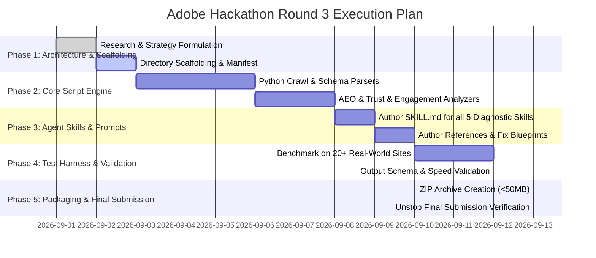

# Execution Timeline & Milestone Roadmap (Submission: September 13, 2026)

## 1. Hackathon Timeline Overview

* **Round 3 Active Period:** August 27, 2026, 02:30 PM IST — September 13, 2026, 11:59 PM IST
* **Submission Format:** ZIP of Marketplace Root Directory (`≤ 50 MB`), containing `marketplace.json`, all `skills/` folders, and root `README.md`.

---

## 2. Phased Milestone Execution Schedule



---

## 3. Detailed Milestone Tasks

### Milestone 1: Architectural Scaffolding & Manifest Setup (Sep 1 – Sep 3)
* [x] Formulate Master Strategy, Winner Analysis, and System Architecture docs in `docs/`.
* [ ] Scaffold the marketplace directory structure under `marketplace/` or root:
  * `marketplace.json`
  * `skills/audit-orchestrator/`
  * `skills/crawl-render-audit/`
  * `skills/structured-entity-audit/`
  * `skills/aeo-quotability-audit/`
  * `skills/freshness-corroboration-audit/`
  * `skills/on-site-engagement-audit/`

---

### Milestone 2: Deterministic Python Engine & Fast Analyzers (Sep 3 – Sep 8)
* [ ] Build `scripts/crawl_inspector.py`:
  * Bounded fetching (`urllib`), robots.txt parser for AI bots (`GPTBot`, `ClaudeBot`, `PerplexityBot`, `Google-Extended`, `Bytespider`).
  * Response header inspection (`X-Robots-Tag`, caching).
* [ ] Build `scripts/schema_validator.py`:
  * JSON-LD AST extractor and Schema.org compliance checker.
  * `sameAs` entity link verification against Wikidata/Crunchbase/Wikipedia.
* [ ] Build `scripts/quotability_scorer.py`:
  * Text-to-noise ratio calculation, heading hierarchy parser, image alt text audit.
* [ ] Build `scripts/trust_corroborator.py`:
  * Temporal date detector, NAP consistency checker, trust policy verifier.
* [ ] Build `scripts/engagement_evaluator.py`:
  * Above-the-fold value proposition, CTA specificity, and usable-form signals.
* [ ] Build `scripts/audit_runner.py`:
  * Master orchestrator CLI that composes all diagnostic analyzers sequentially from one parsed document, aggregates findings, and exports the JSON report.

---

### Milestone 3: Agent Skills Authoring & Progressive Disclosure (Sep 8 – Sep 10)
* [ ] Write `SKILL.md` for `audit-orchestrator` and all 5 diagnostic sub-skills per `agentskills.io` specification.
* [ ] Populate all `references/` directories:
  * `references/audit_schema.json` (Strict output validator)
  * `references/ai_user_agents.md` (Known AI bot user-agent signatures)
  * `references/schema_blueprints.md` (Golden standard JSON-LD templates)
  * `references/geo_guidelines.md` (Generative Engine Optimization rules)
  * `references/authority_signals.md` (E-E-A-T trust signals)
  * `references/ux_heuristic_checklist.md` (Engagement heuristics)

---

### Milestone 4: Multi-Domain Benchmarking & Edge-Case Hardening (Sep 10 – Sep 12)
* [ ] Test against 20+ diverse real-world websites across different industry verticals:
  1. **SaaS Platforms:** (e.g., Stripe, Supabase, Linear, Vercel, Resend)
  2. **E-Commerce Stores:** (e.g., Shopify storefronts, Nike, local DTC brands)
  3. **Heavy Client-Side SPAs:** (e.g., React/Vue web applications)
  4. **Documentation & Knowledge Bases:** (e.g., MDN, Next.js docs)
  5. **Local Businesses & Services:** (e.g., dental clinics, law firms with incomplete schemas)
* [ ] Validate that every site completes in `< 30 seconds` (well below the 5-minute limit).
* [ ] Verify zero crashes, zero network hangs, and zero unhandled exceptions.

---

### Milestone 5: Packaging, Final Review & Submission (Sep 13)
* [ ] Verify file sizes: Ensure total repository and ZIP payload is `< 50 MB` (no heavy weights or node_modules).
* [ ] Validate `marketplace.json` and each `SKILL.md` using `agentskills` validation tooling.
* [ ] Generate submission ZIP archive:
  ```bash
  zip -r brand-ai-readiness-audit.zip marketplace.json README.md skills/
  ```
* [ ] Submit ZIP file on the Unstop Portal before **September 13, 2026, 11:59 PM IST**.

---

## 4. Pre-Submission Quality Gate Checklist

| # | Check Item | Status |
| :---: | :--- | :---: |
| 1 | `marketplace.json` exists at root with exactly one `entrypoint: true` | [ ] |
| 2 | Every skill folder in `skills/` contains a valid `SKILL.md` with YAML frontmatter | [ ] |
| 3 | JSON output matches the official required schema (floor) | [ ] |
| 4 | Every finding has `id`, `title`, `severity`, `evidence`, and `suggested_action` | [ ] |
| 5 | Output summary contains `site`, `audited_at`, and counts by severity | [ ] |
| 6 | Submissions runs read-only without mutating external websites | [ ] |
| 7 | Audit runtime is `< 5 minutes` per site | [ ] |
| 8 | Zip file size is `≤ 50 MB` | [ ] |
| 9 | Root `README.md` clearly documents skill architecture, usage, and examples | [ ] |
