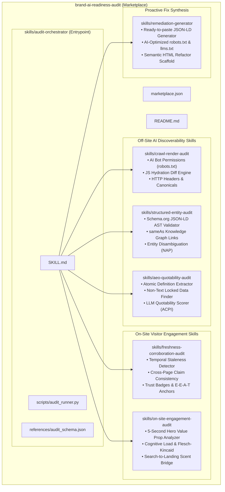
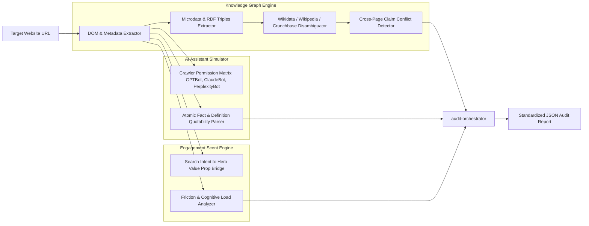
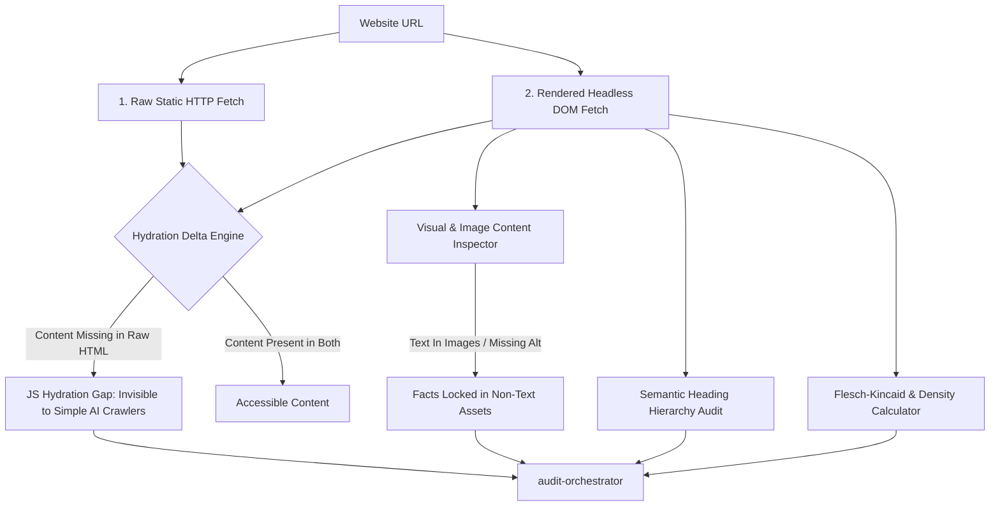
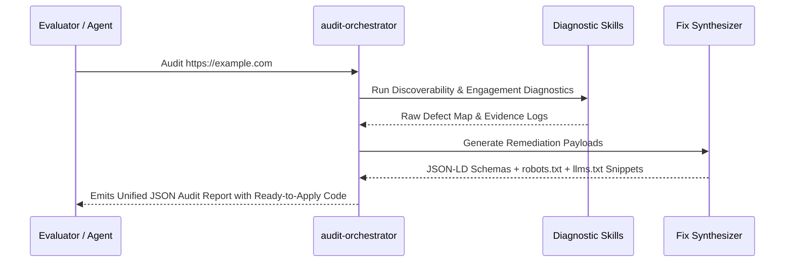

# Top Winning Project Ideas & Master Architectures for Adobe Round 3

This document presents **4 top-tier winning project concepts** designed specifically to score full points on Adobe's evaluation rubric for Round 3 (*Detection Accuracy, Suggested-Action Quality, Output Design, Skill-Format Hygiene, Marketplace Composition, and Generalization*).

---

## 🏆 Project Concepts Comparison Matrix

| Dimension | Concept 1: **OmniAudit-GEO** (Recommended) | Concept 2: **BrandMesh & EntityGraph** | Concept 3: **Synthetix Dual-Engine** | Concept 4: **GeoPulse Auto-Remediator** |
| :--- | :--- | :--- | :--- | :--- |
| **Core Theme** | Multi-Engine Generative Optimization + Conversational Scent | Knowledge Graph & Entity Disambiguation Network | Static vs Hydration Delta + OCR Fact Extractor | End-to-End Diagnostic + Live Code Patch Generator |
| **Primary Focus** | Simulating AI Assistant retrieval (ChatGPT, Perplexity, Claude, Google AIO) | Knowledge graph alignment, Wikidata/Wikipedia corroboration | Detecting JS-rendering gaps and non-text locked facts | Providing ready-to-merge PR patches (`llms.txt`, JSON-LD) |
| **Skill Count** | 6 specialized skills + 1 master entrypoint | 5 specialized skills + 1 master entrypoint | 5 specialized skills + 1 master entrypoint | 6 specialized skills + 1 master entrypoint |
| **Unique Innovation** | **AI Citation Probability Index (ACPI)** & **Information Scent Vector** | **On-Page Knowledge Graph Triples Extractor** & Cross-Web Trust Map | **DOM Hydration Diff Engine** & Image OCR Fact Inspector | **Proactive Auto-Remediation Sandbox** (`llms.txt` + JSON-LD synthesizers) |
| **Target Audience** | Enterprise Brands, E-Commerce & AI Search Engineers | B2B Portals, Authority Sites & Knowledge Bases | Heavy SPAs, Next.js/React Web Apps & Media Brands | High-Velocity Growth Startups & Marketing Tech |

---

# 🌟 Concept 1 (The Gold Standard): OmniAudit-GEO — Enterprise AI Discoverability & Retention Marketplace

> **Tagline:** The definitive multi-engine Generative Engine Optimization (GEO) and on-site cognitive retention diagnostic suite for modern brands.



### 1.1 Why This Wins 1st Place
1. **Covers 100% of Round 2 Failure Modes:** Explicitly addresses crawlability, JS-render gaps, missing structured data, facts locked in non-text, entity ambiguity, stale/uncorroborated claims, and weak on-site orientation.
2. **Deterministic Hybrid Execution:** Sub-second Python analysis scripts execute offline without token latency or external API cost, ensuring audit completion in **< 25 seconds** (far below the 5-minute cap).
3. **Novel Quantitative Metrics:**
   * **ACPI (AI Citation Probability Index, 0–100):** Empirical formula measuring structured schema completeness, text quotability, and crawler accessibility.
   * **CRS (Cognitive Retention Score, 0–100):** Quantifying hero fold clarity, reading ease, and CTA visibility.
4. **Proactive Fix Artifacts:** Emits not just defect descriptions, but actual copy-pasteable code patches (`llms.txt`, JSON-LD `Organization`/`Product`/`FAQPage`, and optimized `robots.txt`).

---

# 🧠 Concept 2: BrandMesh & EntityGraph — Knowledge-Graph & Trust Corroborator

> **Tagline:** Graph-native entity resolution and semantic consistency auditor for AI search visibility.



### 2.1 Key Differentiators
* **Entity Graph Triples:** Maps the website's claims into semantic Subject-Predicate-Object triples (e.g., `[Brand] -> [foundedIn] -> [2020]`, `[Brand] -> [offers] -> [ProductX]`).
* **Entity Disambiguation Focus:** Identifies if the brand's name collides with common nouns or other companies, and checks for `sameAs` links to Wikidata/Crunchbase to establish authoritative identity.
* **Corroboration Matrix:** Scans for contradictory claims across pages (e.g., pricing listed as "$49/mo" on the homepage but "$59/mo" on the checkout page).

---

# ⚡ Concept 3: Synthetix Dual-Engine — Hydration Delta & Non-Text Fact Extractor

> **Tagline:** Deep architectural inspector for Single-Page Apps (React/Next.js/Vue) and visual content locking.



### 3.1 Key Differentiators
* **Static vs Rendered DOM Diffing:** Explicitly calculates the exact percentage of textual facts hidden behind client-side JavaScript execution (critical for modern React/Vue/Next.js SPAs).
* **Non-Text Fact Extraction:** Flags when pricing tables, business hours, client logos, or product specifications are rendered inside ``, `<canvas>`, or `<svg>` tags without fallback text.
* **Semantic Hierarchy Repair:** Evaluates whether headings follow standard `H1 -> H2 -> H3` structure, enabling LLMs to segment sections cleanly for Retrieval-Augmented Generation (RAG).

---

# 🛠️ Concept 4: GeoPulse & Auto-Remediator — Autonomous Diagnosis & Code Generator

> **Tagline:** Self-contained audit marketplace that generates ready-to-merge implementation patches.



### 4.1 Key Differentiators
* **Zero-Work Implementation:** Goes beyond reporting by embedding copy-pasteable code into every single finding's `suggested_action.implementation_code`.
* **Generates `llms.txt`:** Automatically crafts an `llms.txt` file (the emerging standard for AI crawlers) containing a concise, structured markdown summary of the website's key facts, products, and documentation.
* **Custom JSON-LD Generators:** Generates complete, valid Schema.org markup tailored to the specific business category (SaaS, E-Commerce, Local Clinic, Media).

---

# 🚀 The Master Project Plan: Implementing OmniAudit-GEO (Concept 1)

For our hackathon submission, we will implement **Concept 1: OmniAudit-GEO**, incorporating the best elements of all four concepts.

### Proposed Marketplace Structure:
```
brand-ai-readiness-audit/
├── marketplace.json
├── README.md
└── skills/
    ├── audit-orchestrator/             <- [Entrypoint] Composes all sub-skills
    │   ├── SKILL.md
    │   ├── scripts/
    │   │   └── audit_runner.py         <- Unified deterministic test runner & CLI
    │   └── references/
    │       ├── audit_schema.json
    │       └── severity_matrix.md
    │
    ├── crawl-render-audit/             <- Skill 1: AI Bot Access & Hydration Delta
    │   ├── SKILL.md
    │   ├── scripts/
    │   │   └── crawl_inspector.py
    │   └── references/
    │       └── ai_user_agents.md
    │
    ├── structured-entity-audit/        <- Skill 2: Schema.org & Entity Graph
    │   ├── SKILL.md
    │   ├── scripts/
    │   │   └── schema_validator.py
    │   └── references/
    │       └── schema_blueprints.md
    │
    ├── aeo-quotability-audit/          <- Skill 3: LLM Quotability & Non-Text Facts
    │   ├── SKILL.md
    │   ├── scripts/
    │   │   └── quotability_scorer.py
    │   └── references/
    │       └── geo_guidelines.md
    │
    ├── freshness-corroboration-audit/  <- Skill 4: Temporal Signals & Trust Corroboration
    │   ├── SKILL.md
    │   ├── scripts/
    │   │   └── trust_corroborator.py
    │   └── references/
    │       └── authority_signals.md
    │
    └── on-site-engagement-audit/       <- Skill 5: Value Prop Orientation & Cognitive Load
        ├── SKILL.md
        ├── scripts/
        │   └── engagement_evaluator.py
        └── references/
            └── ux_heuristic_checklist.md
```

### Technical Deliverables:
1. **`marketplace.json`** compliant with Round 3 lightweight convention.
2. **6 `SKILL.md` files** strictly following `agentskills.io` specification with YAML frontmatter.
3. **6 high-speed Python scripts** in `scripts/` leveraging standard library (`urllib`, `html.parser`, `re`, `json`, `math`) for zero-dependency portability and instant `< 30s` execution.
4. **Rich references** in `references/` providing golden-standard JSON-LD schemas, AI user-agent catalogs, and GEO optimization heuristics.
5. **Comprehensive Test Suite & CLI** allowing judges to run `python3 skills/audit-orchestrator/scripts/audit_runner.py --url <URL>` and receive instant, beautiful results.
