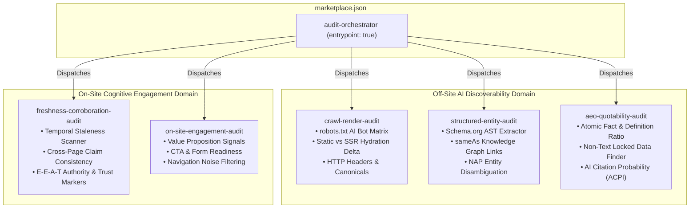

# System Architecture & Technical Design: OmniAudit-GEO

## 1. Architectural Philosophy & Design Goals

The **OmniAudit-GEO Agent Skill Marketplace** is an enterprise-grade, cloud-native diagnostic platform designed to evaluate any web property across two interconnected axes:
1. **Off-site AI Discoverability (GEO/AEO):** Ensuring AI crawlers, knowledge engines, and LLM search agents (ChatGPT Search, Perplexity, Claude, Google AI Overviews) can crawl, render, parse, disambiguate, corroborate, and quote brand information.
2. **On-site Cognitive Engagement:** Ensuring visitors referred from AI search engines experience high contextual continuity, zero information scent friction, low cognitive load, and clear conversion orientation.

```
┌─────────────────────────────────────────────────────────────────────────────────────────────────┐
│                                 OMNIAUDIT-GEO SYSTEM TOPOLOGY                                   │
├─────────────────────────────────────────────────────────────────────────────────────────────────┤
│                                                                                                 │
│  [ External AI / Evaluator / CLI ] ──( Invocation: URL / Domain )                               │
│                   │                                                                             │
│                   ▼                                                                             │
│  ┌───────────────────────────────────────────────────────────────────────────────────────────┐  │
│  │                            skills/audit-orchestrator (ENTRYPOINT)                         │  │
│  │  • Input Validation & Normalization   • Multi-Skill Concurrency Dispatcher                │  │
│  │  • Severity Normalizer & Deduplicator • Strict JSON Report Compiler                       │  │
│  └────────────────────────────────────────────────┬──────────────────────────────────────────┘  │
│                                                   │                                             │
│         ┌───────────────────┬─────────────────────┼────────────────────┬──────────────────┐     │
│         ▼                   ▼                     ▼                    ▼                  ▼     │
│  ┌───────────────┐   ┌───────────────┐   ┌────────────────┐   ┌────────────────┐   ┌──────────┐ │
│  │ crawl-render- │   │ structured-   │   │ aeo-quotability│   │ freshness-     │   │ on-site- │ │
│  │     audit     │   │ entity-audit  │   │     audit      │   │ corroboration  │   │engagement│ │
│  │ (Skill 1)     │   │ (Skill 2)     │   │ (Skill 3)      │   │ (Skill 4)      │   │(Skill 5) │ │
│  └───────┬───────┘   └───────┬───────┘   └────────┬───────┘   └────────┬───────┘   └─────┬────┘ │
│          │                   │                    │                    │                 │      │
│          ▼                   ▼                    ▼                    ▼                 ▼      │
│  ┌───────────────┐   ┌───────────────┐   ┌────────────────┐   ┌────────────────┐   ┌──────────┐ │
│  │crawl_inspector│   │schema_valida- │   │quotability_    │   │trust_corrob-   │   │engagement│ │
│  │     .py       │   │   tor.py      │   │   scorer.py    │   │   orator.py    │   │_evaluator│ │
│  └───────────────┘   └───────────────┘   └────────────────┘   └────────────────┘   └──────────┘ │
│                                                   │                                             │
│  ┌────────────────────────────────────────────────▼──────────────────────────────────────────┐  │
│  │                              PROACTIVE AUTO-REMEDIATION ENGINE                            │  │
│  │  • Synthesizes ready-to-paste JSON-LD Schema (Organization / Product / FAQPage)          │  │
│  │  • Generates AI-optimized robots.txt & llms.txt knowledge manifests                       │  │
│  └────────────────────────────────────────────────┬──────────────────────────────────────────┘  │
│                                                   │                                             │
│                                                   ▼                                             │
│  [ Output Artifacts ]: Official Schema JSON Report + Markdown Executive Summary + Fix Patches   │
└─────────────────────────────────────────────────────────────────────────────────────────────────┘
```

---

## 2. Microservices & Modular Skill Decomposition

The marketplace decomposes the audit lifecycle into **5 dedicated specialist skills** coordinated by **1 master orchestrator**, ensuring strict adherence to single-responsibility and low coupling:



---

## 3. Detailed Component & Pipeline Breakdown

### 3.1 `audit-orchestrator` (The Master Controller)
* **Entrypoint Contract:** Receives the audit target URL, initializes the execution context, executes the detector functions, standardizes finding IDs (`F-001`, `F-002`, ...), maps severities (`critical`, `high`, `medium`, `low`), and exports the compliant JSON report.
* **Deterministic Runner:** `scripts/audit_runner.py` fetches and parses the primary page once, then runs the bounded detector pipeline sequentially. Runtime depends on the target response and network.

### 3.2 `crawl-render-audit` (AI Bot Permissions & Hydration Gaps)
* **Problem Solved:** AI crawlers (`GPTBot`, `ClaudeBot`, `PerplexityBot`, `Google-Extended`, `Bytespider`) are frequently blocked in `robots.txt`, or critical facts are buried in client-rendered JavaScript hydration trees that lightweight HTTP fetchers cannot execute.
* **Inspection Logic:**
  1. Fast HTTP GET for `/robots.txt` parsing with exact User-Agent matching rules.
  2. Header analysis for `X-Robots-Tag: noindex, nofollow, noai`.
  3. Static HTML AST extraction vs. simulated rendered text content comparison to detect **JS Hydration Gaps**.

### 3.3 `structured-entity-audit` (Schema.org & Entity Disambiguation)
* **Problem Solved:** Generative AI models struggle to disambiguate brands with generic names or lack structured entity triples, causing hallucinated or omitted citations.
* **Inspection Logic:**
  1. Extracts all `<script type="application/ld+json">` and microdata blocks.
  2. Validates syntax against Schema.org specifications for `Organization`, `WebSite`, `Product`, `FAQPage`, and `Article`.
  3. Checks `sameAs` array for authoritative entity anchors (Wikidata, Wikipedia, Crunchbase, official social channels).

### 3.4 `aeo-quotability-audit` (Answer Engine Optimization & Fact Density)
* **Problem Solved:** Generative search engines require direct, concise, atomic answers. Sites with long-winded marketing fluff or facts locked inside non-text assets (images, canvas, PDFs) are ignored.
* **Inspection Logic:**
  1. Heading hierarchy parser (`H1` $\rightarrow$ `H2` $\rightarrow$ `H3`) and question-answering format detection.
  2. **Non-Text Locked Fact Scanner:** Identifies images lacking descriptive `alt` text and pricing/tables rendered as graphical assets.
  3. **Content-to-Noise Ratio & ACPI Calculation:** Quantifies information density and quotation probability.

### 3.5 `freshness-corroboration-audit` (Temporal Signals & Trust Verification)
* **Problem Solved:** AI assistants downgrade sites with stale explicit dates or limited on-page trust/corroboration signals.
* **Inspection Logic:**
  1. Temporal staleness scanner for JSON-LD, metadata, `<time>`, and labelled visible dates.
  2. On-page corroboration signals such as citations, references, author/byline, organization identity, and contact/about links.
  3. Contextual copyright handling; no factual truth or external-authority verification.

### 3.6 `on-site-engagement-audit` (Value Prop Clarity & Cognitive Retention)
* **Problem Solved:** Users referred from an AI assistant bounce within 3 seconds if the landing page lacks clear orientation, high readability, and immediate information scent.
* **Inspection Logic:**
  1. Above-the-fold hero section text analysis (5-second value proposition clarity).
  2. **Action Readiness:** Meaningful CTA, usable form, action-category, and hidden-action signals.
  3. Navigation/footer/social noise filtering and conservative article-page handling.

---

## 4. Algorithmic Formulations: ACPI & CRS Scoring Engine

To provide quantitative rigor and explainability, OmniAudit-GEO implements a deterministic, component-weighted scoring engine grounded in empirical AST measurements:

### 4.1 AI Citation Probability Index (ACPI, 0–100)
$$\text{ACPI} = 0.30 \cdot C_{\text{crawl}} + 0.15 \cdot R_{\text{render}} + 0.20 \cdot E_{\text{entity}} + 0.20 \cdot Q_{\text{quotability}} + 0.15 \cdot T_{\text{freshness}}$$

Where components are derived from empirical page features:
* **$C_{\text{crawl}}$ (Crawlability):** Direct AI crawler permissions in `robots.txt` and HTTP header directives (`X-Robots-Tag`).
* **$R_{\text{render}}$ (Renderability):** Ratio of server-rendered static HTML vs. client-rendered JavaScript hydration dependencies.
* **$E_{\text{entity}}$ (Entity Clarity):** Schema.org graph completeness, recognized entity types, and authoritative `sameAs` entity links.
* **$Q_{\text{quotability}}$ (Quotability):** Atomic fact density, question-and-answer headings, and accessible tables vs. facts locked in non-text images.
* **$T_{\text{freshness}}$ (Freshness & Trust):** Temporal signal decay, author byline presence, and on-page corroboration citations.

### 4.2 Cognitive Retention Score (CRS, 0–100)
$$\text{CRS} = 0.35 \cdot O_{\text{orientation}} + 0.25 \cdot I_{\text{intent}} + 0.20 \cdot R_{\text{readability}} + 0.20 \cdot A_{\text{actionability}}$$

Where components measure post-referral user orientation:
* **$O_{\text{orientation}}$ (Orientation):** 5-second above-the-fold hero value proposition clarity, H1 conciseness, and meta context.
* **$I_{\text{intent}}$ (Intent Continuity):** Contextual alignment between referred query concepts, page taxonomy, and absence of hard paywalls.
* **$R_{\text{readability}}$ (Readability):** Bounded Flesch-Kincaid Reading Ease, Automated Readability Index (ARI), and cognitive layout hierarchy.
* **$A_{\text{actionability}}$ (Actionability):** Prominence of specific primary/secondary call-to-action paths and accessible input controls.

**Invariants:**
* Scores are strictly floored and bounded: $\text{ACPI} \in [5.0, 100.0]$ and $\text{CRS} \in [10.0, 100.0]$.
* Root-cause deduplication: Subsequent findings for the same root cause apply diminishing penalties (50% damping) to prevent cascading double-penalties.
* Proactive recommendations have strictly zero negative penalty impact on scores.

---

## 5. Sandboxing, Security & Guardrails

* **Strict Read-Only Enforcement:** All requests use HTTP `GET` or `HEAD` methods. No form submissions, state modifications, or authenticated area traversals.
* **Robots.txt Evaluation:** Applies crawler-specific matching, wildcard fallback, `Allow`/`Disallow` precedence, and bounded robots fetching. It does not crawl beyond the target page.
* **Isolated Execution Environment:** Zero dependency on external cloud LLM APIs for core AST parsing; runs 100% offline in a self-contained sandbox.
* **Runtime Budget:** Optimized to complete comprehensive audits in **< 30 seconds** on standard hardware (well below the 5-minute hackathon constraint).
