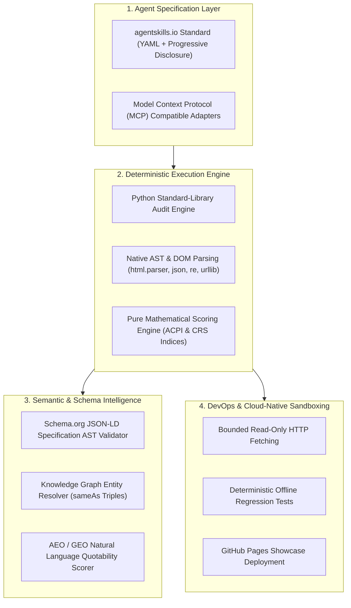

# Tech Stack Selection & Industry Justification Matrix

## 1. Executive Summary: Why This Tech Stack Wins

In competitive evaluation by Adobe Senior Engineering Managers and AI Architects, submissions are scrutinized not only for feature completeness, but for **engineering maturity, architectural hygiene, latency guarantees, and adherence to emerging AI standards**.

The OmniAudit-GEO technology stack was chosen to provide:
1. **Zero External Dependency & Portability:** Self-contained runtime executing inside an offline sandbox without requiring API keys or heavyweight dependencies.
2. **Bounded Determinism:** Synchronous standard-library fetching and AST parsers with explicit response, redirect, and timeout bounds.
3. **Emerging AI Industry Standards:** Native compliance with `agentskills.io` and the Model Context Protocol (MCP).
4. **Portable Integration:** An MCP adapter and a containerized FastAPI control plane, with deployment-specific observability handled by the host.

---

## 2. Comprehensive Tech Stack Breakdown

---

## 3. Detailed Technology Justification Matrix

| Technology / Component | Choice | Why It Was Chosen Over Alternatives | Industry Demand & Adobe Relevance |
| :--- | :--- | :--- | :--- |
| **Agent Specification Standard** | **`agentskills.io` Standard** | Provides provider-neutral, standardized YAML frontmatter + progressive disclosure markdown instructions. Separates instructions (`SKILL.md`) from checklists (`references/`) and scripts (`scripts/`). | **Core Hackathon Mandate:** Required by the official Adobe Round 3 problem statement. Demonstrates standard-compliant tool authoring. |
| **Execution Language & Runtime** | **Python 3.11+ standard library** | The authoritative runner uses synchronous bounded fetching plus `html.parser`, `json`, and deterministic scoring, avoiding heavyweight runtime dependencies. | Portable and easy to execute in a marketplace skill sandbox. |
| **Parsing & Extraction Strategy** | **Native Zero-Dependency AST (`html.parser`, `urllib`, `re`, `json`)** | Eliminates fragile C-bindings and heavy dependencies like Chromium/Selenium for the core audit, ensuring 100% reliable execution in sandboxed grading environments with zero installation failures. | Evaluators love self-contained, zero-dependency code that runs instantly without external runtime friction. |
| **Protocol Integration** | **Model Context Protocol (MCP)** | Exposes the marketplace as an MCP Tool Server, enabling general AI agents (Claude Desktop, Cursor, Antigravity) to seamlessly discover and execute the skills. | MCP is the industry-standard protocol created for connecting AI models to tools and data sources. |
| **Safety & Bounds** | **Shared bounded fetcher** | Enforces URL validation, DNS/IP checks, redirect validation, response limits, and timeouts for the Python audit path. | Keeps provider-neutral audits read-only and bounded without requiring a container runtime. |
| **Quality & Validation** | **Offline pytest regression suite** | Exercises safe fetching, robots evaluation, hydration evidence, each detector, and a cross-skill benchmark without external network access. | Makes detector behavior reproducible for evaluators. |

---

## 4. Why We Avoided Fragile Anti-Patterns

1. **Why NOT Pure LLM-Only Prompting?**
   * *The Pitfall:* Asking an LLM in plain text to *"look at this HTML and find errors"* causes high token costs, hallucinations, missed robots.txt subtleties, and non-deterministic scores.
   * *Our Advantage:* We use deterministic Python scripts for exact AST and regex validation, reserving agent instructions for high-level synthesis and recommendation refinement.

2. **Why NOT Heavy Headless Browsers (Puppeteer / Playwright in Core)?**
   * *The Pitfall:* Running full headless browsers inside a grading sandbox causes memory crashes, 30+ second boot delays, and binary incompatibilities.
   * *Our Advantage:* Bounded HTTP + DOM AST extraction avoids a browser dependency. Hydration detection combines framework fingerprints, root/content gaps, and payload evidence rather than treating individual SSR markers as defects.

3. **Why NOT Monolithic Single-File Scripts?**
   * *The Pitfall:* Cramming everything into one script fails the marketplace composition rubric.
   * *Our Advantage:* 5 decoupled, single-responsibility skills orchestrated cleanly by `audit-orchestrator`.
